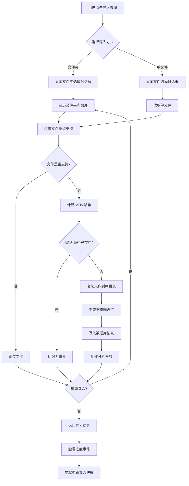
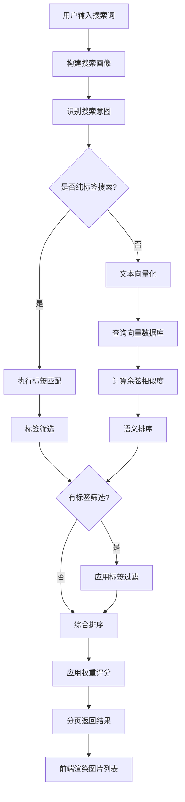
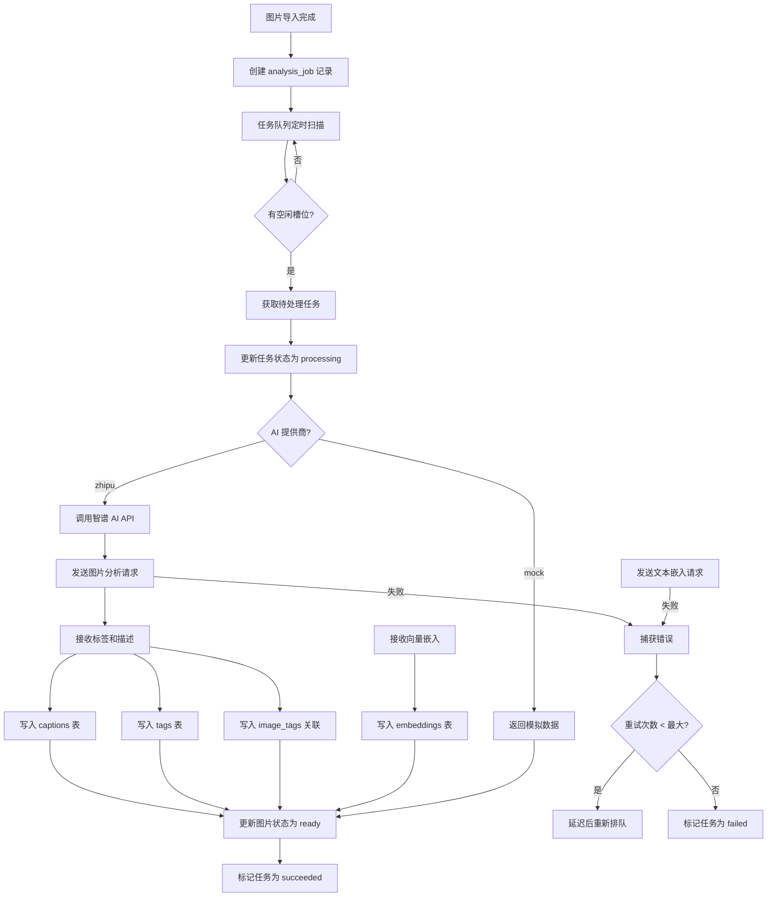
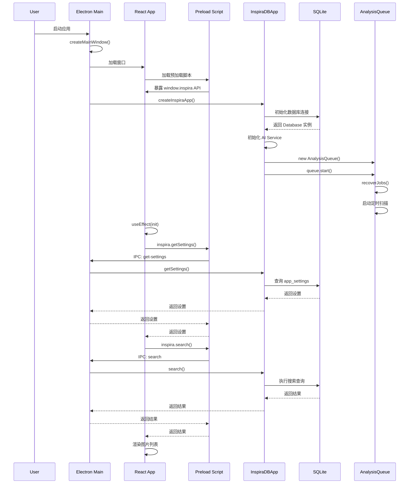
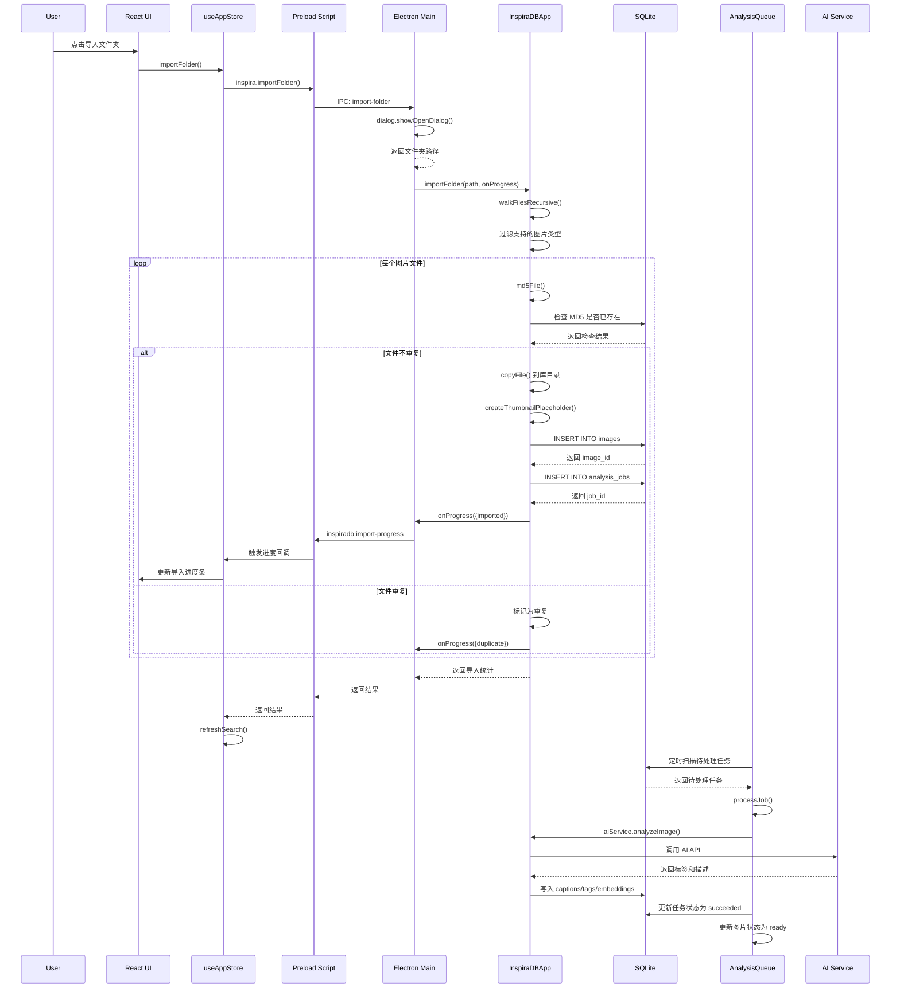
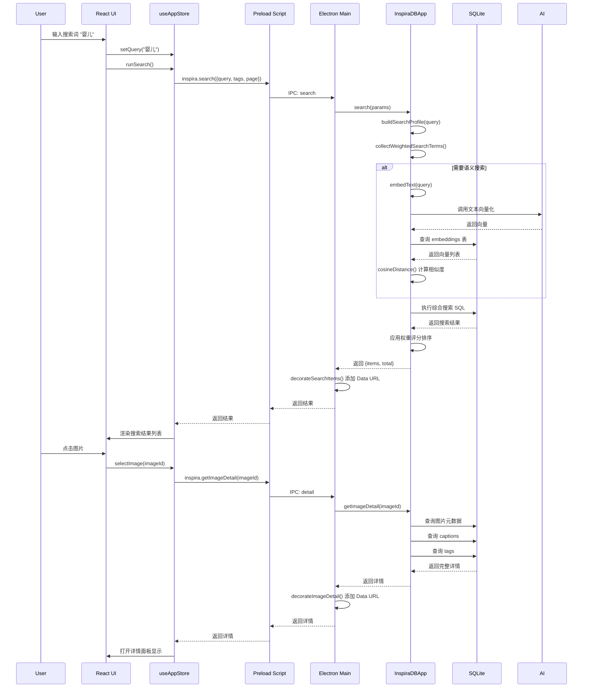
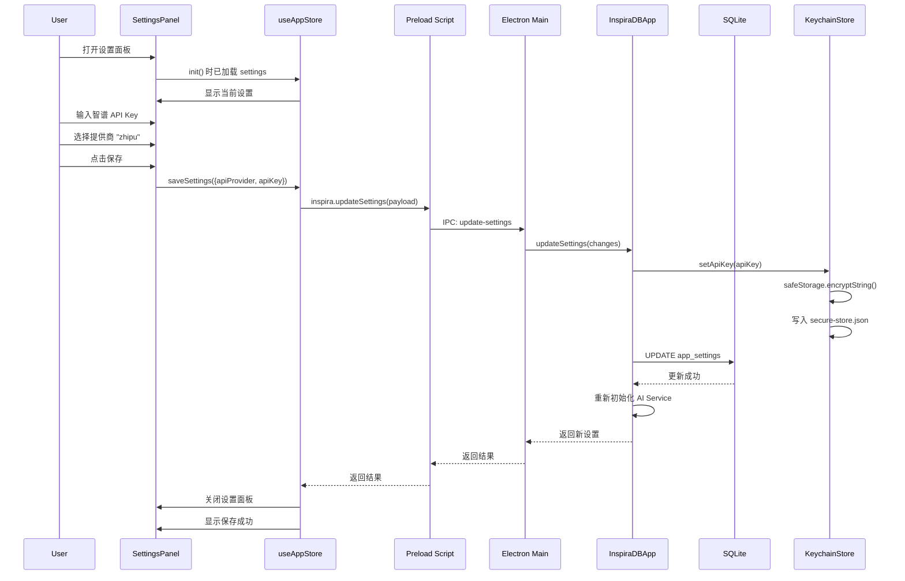

# InspiraDB 项目架构分析文档

> 生成日期：2026-03-19

## 1. 项目概述

**InspiraDB** 是一款面向独立设计师的桌面端灵感素材管理应用，基于 Electron + React 构建，专为 macOS 平台设计。

### 1.1 核心功能
- 📁 本地图片素材库管理
- 🤖 AI 自动分析图片内容（标签、描述）
- 🔍 语义搜索 + 标签筛选
- 📤 批量导入/导出
- 🔐 API Key 安全存储

### 1.2 项目基本信息
| 属性 | 值 |
|------|-----|
| 应用名称 | InspiraDB |
| 版本 | 0.2.0 |
| 应用 ID | `com.inspiradb.desktop` |
| 目标平台 | macOS 13.0+ |
| 分发方式 | DMG / Mac App Store |

---

## 2. 技术栈

### 2.1 核心技术

```
┌─────────────────────────────────────────────────────────────┐
│                        运行环境                              │
│  Node.js >= 24 (原生 ES Modules)                             │
└─────────────────────────────────────────────────────────────┘
                              │
        ┌─────────────────────┼─────────────────────┐
        ▼                     ▼                     ▼
┌──────────────┐    ┌──────────────────┐    ┌──────────────┐
│  桌面框架     │    │    前端框架       │    │   构建工具    │
│  Electron    │    │  React 18.3.1    │    │  Vite 7.1.7  │
│  v37.5.0     │    │  + Zustand       │    │              │
└──────────────┘    └──────────────────┘    └──────────────┘
```

### 2.2 完整依赖清单

#### 运行时依赖
| 依赖 | 版本 | 用途 |
|------|------|------|
| `electron` | ^37.5.0 | 桌面应用框架 |
| `react` | ^18.3.1 | UI 框架 |
| `react-dom` | ^18.3.1 | DOM 渲染 |
| `zustand` | ^5.0.8 | 状态管理 |
| `lucide-react` | ^0.552.0 | 图标库 |

#### 样式与 UI
| 依赖 | 版本 | 用途 |
|------|------|------|
| `tailwindcss` | ^3.4.18 | CSS 工具类 |
| `class-variance-authority` | ^0.7.1 | 组件变体 |
| `clsx` | ^2.1.1 | 条件类名 |
| `tailwind-merge` | ^3.3.1 | 类名合并 |

#### 系统能力
| 模块 | 来源 | 用途 |
|------|------|------|
| `node:sqlite` | Node.js 内置 | SQLite 数据库 (DatabaseSync) |
| `node:fs` | Node.js 内置 | 文件系统操作 |
| `node:crypto` | Node.js 内置 | UUID 生成 |
| `electron safeStorage` | Electron API | 系统级加密存储 |

---

## 3. 系统架构

### 3.1 整体架构图

```
┌──────────────────────────────────────────────────────────────────────┐
│                         表现层 (Renderer)                             │
│  ┌───────────────────────────────────────────────────────────────┐  │
│  │                    React 18 + Vite                             │  │
│  │  ┌──────────────┐  ┌──────────────┐  ┌──────────────────┐    │  │
│  │  │  AppSidebar  │  │   Library    │  │   DetailPanel    │    │  │
│  │  │   (侧边栏)    │  │  Workspace   │  │    (详情面板)     │    │  │
│  │  └──────────────┘  └──────────────┘  └──────────────────┘    │  │
│  │                                                              │  │
│  │  ┌────────────────────────────────────────────────────────┐  │  │
│  │  │              useAppStore (Zustand)                      │  │  │
│  │  │         状态管理：搜索、导入、详情、设置                 │  │  │
│  │  └────────────────────────────────────────────────────────┘  │  │
│  └───────────────────────────────────────────────────────────────┘  │
└──────────────────────────────────────────────────────────────────────┘
                                    │
                                    │ IPC (electron contextBridge)
                                    ▼
┌──────────────────────────────────────────────────────────────────────┐
│                         桥接层 (Preload)                              │
│  ┌───────────────────────────────────────────────────────────────┐  │
│  │                      preload.js                                │  │
│  │    安全暴露 API：window.inspira.*                              │  │
│  │    - invoke(channel, payload)                                  │  │
│  │    - onImportProgress(callback)                                │  │
│  │    - search(), importFolder(), exportImage() ...               │  │
│  └───────────────────────────────────────────────────────────────┘  │
└──────────────────────────────────────────────────────────────────────┘
                                    │
                                    │ IPC (ipcMain.handle)
                                    ▼
┌──────────────────────────────────────────────────────────────────────┐
│                         主进程 (Main)                                 │
│  ┌───────────────────────────────────────────────────────────────┐  │
│  │                      main.js                                   │  │
│  │  - 窗口管理 (BrowserWindow)                                    │  │
│  │  - IPC 处理器注册                                              │  │
│  │  - 系统对话框 (dialog)                                         │  │
│  │  - 剪贴板操作 (clipboard, nativeImage)                         │  │
│  └───────────────────────────────────────────────────────────────┘  │
└──────────────────────────────────────────────────────────────────────┘
                                    │
                                    │ 直接调用
                                    ▼
┌──────────────────────────────────────────────────────────────────────┐
│                        核心业务层 (Core)                              │
│  ┌───────────────────────────────────────────────────────────────┐  │
│  │                  InspiraDBApp                                  │  │
│  │  ┌───────────────┐  ┌──────────────┐  ┌───────────────┐       │  │
│  │  │  InspiraDB    │  │ RoutedAi     │  │ AnalysisQueue │       │  │
│  │  │  (Database)   │  │   Service    │  │  (任务队列)    │       │  │
│  │  └───────────────┘  └──────────────┘  └───────────────┘       │  │
│  │                                                              │  │
│  │  ┌───────────────┐  ┌──────────────┐  ┌───────────────┐       │  │
│  │  │   Keychain    │  │    Files     │  │    Vector     │       │  │
│  │  │    Store      │  │   Utils      │  │    Utils      │       │  │
│  │  └───────────────┘  └──────────────┘  └───────────────┘       │  │
│  └───────────────────────────────────────────────────────────────┘  │
└──────────────────────────────────────────────────────────────────────┘
                                    │
                                    ▼
┌──────────────────────────────────────────────────────────────────────┐
│                         数据存储层 (Storage)                          │
│  ┌────────────────────┐  ┌──────────────────┐  ┌────────────────┐   │
│  │   SQLite DB        │  │   File System    │  │  Secure Store  │   │
│  │  (userData/*.sqlite)│  │ (library/,       │  │ (API Key 加密)  │   │
│  │                    │  │  thumbnails/)    │  │                │   │
│  └────────────────────┘  └──────────────────┘  └────────────────┘   │
└──────────────────────────────────────────────────────────────────────┘
```

---

## 4. 数据库设计

### 4.1 数据库 Schema

```sql
-- 图片主表
CREATE TABLE images (
  id TEXT PRIMARY KEY,
  original_file_name TEXT NOT NULL,
  original_file_ext TEXT,
  original_path TEXT,
  library_path TEXT NOT NULL,
  thumbnail_path TEXT NOT NULL,
  file_size_bytes INTEGER,
  md5_hash TEXT UNIQUE NOTn NULL,
  width INTEGER,
  height INTEGER,
  analysis_status TEXT,  -- pending/analyzing/queued/ready/failed
  needs_embedding_refresh INTEGER DEFAULT 0,
  created_at TEXT NOT NULL,
  updated_at TEXT NOT NULL
);

-- 图片描述
CREATE TABLE captions (
  id TEXT PRIMARY KEY,
  image_id TEXT NOT NULL,
  content TEXT NOT NULL,
  language TEXT,
  source TEXT,  -- ai/user
  is_active INTEGER DEFAULT 1,
  created_at TEXT NOT NULL,
  updated_at TEXT NOT NULL
);

-- 标签字典
CREATE TABLE tags (
  id TEXT PRIMARY KEY,
  name TEXT UNIQUE NOT NULL,
  language TEXT,
  created_at TEXT NOT NULL
);

-- 图片-标签关联
CREATE TABLE image_tags (
  image_id TEXT NOT NULL,
  tag_id TEXT NOT NULL,
  source TEXT,  -- ai/user
  PRIMARY KEY (image_id, tag_id)
);

-- 向量嵌入 (用于语义搜索)
CREATE TABLE embeddings (
  image_id TEXT PRIMARY KEY,
  vector TEXT NOT NULL,  -- JSON array
  dimension INTEGER,
  model_provider TEXT,
  updated_at TEXT NOT NULL
);

-- 分析任务队列
CREATE TABLE analysis_jobs (
  id TEXT PRIMARY KEY,
  image_id TEXT NOT NULL,
  job_type TEXT,  -- analyze_image/refresh_embedding
  status TEXT,    -- pending/processing/retrying/succeeded/failed
  retry_count INTEGER DEFAULT 0,
  max_retry_count INTEGER DEFAULT 3,
  last_error_code TEXT,
  last_error_message TEXT,
  created_at TEXT,
  started_at TEXT,
  finished_at TEXT,
  updated_at TEXT
);

-- 应用设置
CREATE TABLE app_settings (
  id INTEGER PRIMARY KEY,
  api_provider TEXT DEFAULT 'mock',
  api_key_ref TEXT,
  cloud_analysis_enabled INTEGER DEFAULT 0,
  created_at TEXT,
  updated_at TEXT
);
```

---

## 5. 关键函数与模块

### 5.1 主进程 (electron/main.js)

| 函数/处理器 | 职责 | IPC Channel |
|-------------|------|-------------|
| `createMainWindow()` | 创建主窗口 (1520x940) | - |
| `createInspiraApp()` | 初始化核心应用实例 | - |
| `registerIpcHandlers()` | 注册所有 IPC 处理器 | - |
| `fileToDataUrl()` | 图片文件转 Data URL | - |
| Folder Import Handler | 处理文件夹导入 | `inspiradb:import-folder` |
| File Import Handler | 处理单文件导入 | `inspiradb:import-file` |
| Search Handler | 语义+标签搜索 | `inspiradb:search` |
| Export Handler | 导出图片 | `inspiradb:export-image(s)` |
| Copy Handler | 复制到剪贴板 | `inspiradb:copy-image` |
| Detail Handler | 获取图片详情 | `inspiradb:detail` |
| Update Handler | 更新元数据 | `inspiradb:update-caption/tags` |
| Reanalyze Handler | 重新 AI 分析 | `inspiradb:reanalyze` |
| Delete Handler | 删除图片 | `inspiradb:delete` |
| Settings Handler | 获取/更新设置 | `inspiradb:get/update-settings` |

### 5.2 核心应用类 (src/core/inspiradb.js)

| 方法 | 功能描述 |
|------|----------|
| `constructor(options)` | 初始化数据库、AI服务、任务队列 |
| `importFile(filePath)` | 导入单个图片文件 |
| `importFolder(folderPath, options)` | 批量导入文件夹 |
| `search(params)` | 语义搜索+标签筛选+分页 |
| `getImageDetail(imageId)` | 获取图片完整详情 |
| `updateImageCaption(imageId, content)` | 更新图片描述 |
| `updateImageTags(imageId, tagNames)` | 更新图片标签 |
| `exportImage(imageId, targetPath)` | 导出图片到指定路径 |
| `copyImageToClipboard(imageId)` | 复制图片到系统剪贴板 |
| `deleteImage(imageId)` | 删除图片及相关数据 |
| `rebuildAnalysis(imageId)` | 重新触发 AI 分析 |
| `getSettings()` / `updateSettings()` | 应用设置管理 |
| `waitForImportedImagesSettled()` | 等待导入图片分析完成 |

### 5.3 AI 服务 (src/services/)

#### AI Factory (ai-factory.js)
```javascript
class RoutedAiService {
  getProvider()      // 获取当前 AI 提供商 (mock/zhipu)
  getActiveService() // 获取当前激活的服务实例
  analyzeImage(id)   // 分析图片，生成标签和描述
  refreshEmbedding(id) // 刷新向量嵌入
  embedText(text)    // 文本向量化
}
```

#### Analysis Queue (analysis-queue.js)
```javascript
class AnalysisQueue {
  start()           // 启动队列处理循环
  stop()            // 停止队列
  recoverJobs()     // 恢复未完成的任务
  drain()           // 消费待处理任务
  processJob(job)   // 执行单个任务
  markJobSucceeded(job)
  markJobFailure(job, error)
}
```

### 5.4 前端状态管理 (renderer/src/store/useAppStore.js)

| 方法 | 功能 |
|------|------|
| `init()` | 初始化应用，加载设置和搜索 |
| `runSearch()` / `refreshSearch()` | 执行搜索 |
| `loadMore()` | 加载更多结果（分页） |
| `selectTag(tagName)` / `clearTag()` | 标签筛选 |
| `importFolder()` / `importFile()` | 导入操作 |
| `selectImage(imageId)` | 选择图片查看详情 |
| `saveMetadata()` | 保存元数据修改 |
| `exportImage()` / `exportCurrentResultBatch()` | 导出 |
| `copyImage()` | 复制到剪贴板 |
| `rebuildAnalysis()` | 重新分析 |
| `deleteSelected()` | 删除选中图片 |
| `saveSettings()` | 保存应用设置 |

---

## 6. 逻辑流程图

### 6.1 图片导入流程



### 6.2 语义搜索流程



### 6.3 AI 分析流程



---

## 7. 时序图

### 7.1 应用启动时序



### 7.2 图片导入时序



### 7.3 搜索与查看详情时序



### 7.4 设置更新时序



---

## 8. 项目结构

```
littlePin_Mac/
├── build/                    # 构建资源
│   ├── entitlements.mas.plist
│   ├── icon.icns
│   └── icon-1024.png
├── data/                     # 数据文件
├── docs/                     # 文档
│   ├── mac-app-store.md
│   ├── DEPLOY-GUIDE.md
│   ├── privacy-policy.md
│   └── terms-of-use.md
├── electron/                 # Electron 主进程
│   ├── main.js              # 主进程入口
│   └── preload.js           # 预加载脚本
├── renderer/                 # 渲染进程 (前端)
│   ├── index.html
│   └── src/
│       ├── main.jsx         # React 入口
│       ├── App.jsx          # 主应用组件
│       ├── index.css        # 全局样式
│       ├── lib/
│       │   └── utils.js     # 工具函数
│       ├── store/
│       │   └── useAppStore.js  # Zustand 状态
│       └── components/      # UI 组件
│           ├── AppSidebar.jsx
│           ├── LibraryWorkspace.jsx
│           ├── DetailPanel.jsx
│           ├── GalleryCard.jsx
│           ├── SettingsPanel.jsx
│           └── ui/          # 基础 UI 组件
├── scripts/                  # 构建脚本
│   ├── build-mac-icon.mjs
│   ├── build-mas.mjs
│   ├── build-version.cjs
│   └── prepare-mas-upload.mjs
├── src/                      # 核心源代码
│   ├── index.js             # 导出入口
│   ├── cli/
│   │   └── demo.js          # CLI 调试入口
│   ├── core/                # 核心业务逻辑
│   │   ├── config.js        # 配置文件
│   │   ├── database.js      # 数据库操作
│   │   └── inspiradb.js     # 主应用类
│   ├── services/            # 服务层
│   │   ├── ai-factory.js    # AI 服务工厂
│   │   ├── analysis-queue.js # 分析队列
│   │   ├── keychain-store.js # 安全存储
│   │   ├── mock-ai.js       # Mock AI
│   │   └── zhipu-ai.js      # 智谱 AI
│   └── utils/               # 工具函数
│       ├── embedding.js     # 向量嵌入
│       ├── files.js         # 文件操作
│       ├── hash.js          # 哈希计算
│       ├── logger.js        # 日志
│       ├── text.js          # 文本处理
│       ├── vector.js        # 向量计算
│       └── xmp.js           # XMP 元数据
├── test/                     # 测试文件
├── package.json              # 项目配置
├── vite.config.js            # Vite 配置
├── tailwind.config.js        # Tailwind 配置
└── electron-builder.mas*.cjs # MAS 构建配置
```

---

## 9. 关键技术决策

### 9.1 为什么选择 SQLite (Node.js 内置)?
- 零配置，无需额外安装
- 本地单用户场景性能足够
- 支持事务，数据一致性有保障
- Node.js 24+ 原生支持 `node:sqlite`

### 9.2 为什么使用 Zustand 而非 Redux?
- 轻量级，学习成本低
- 无需 Provider 包裹
- 支持异步操作简化
- TypeScript 支持友好

### 9.3 为什么采用 AI Factory 模式?
- 支持多 AI 提供商切换
- Mock 服务便于开发和测试
- 统一接口，业务层无感知

### 9.4 为什么需要 Analysis Queue?
- AI API 调用有速率限制
- 需要失败重试机制
- 应用重启后可恢复任务
- 支持并发控制

---

## 10. 安全考虑

| 方面 | 措施 |
|------|------|
| API Key 存储 | 使用 Electron safeStorage 加密 |
| 数据库 | 本地 SQLite，不对外暴露 |
| IPC 通信 | 通过 preload 脚本严格控制暴露 API |
| 文件系统 | 仅在用户选择目录后操作 |
| 网络请求 | 仅用于 AI 分析，无数据上传 |

---

*文档结束*
